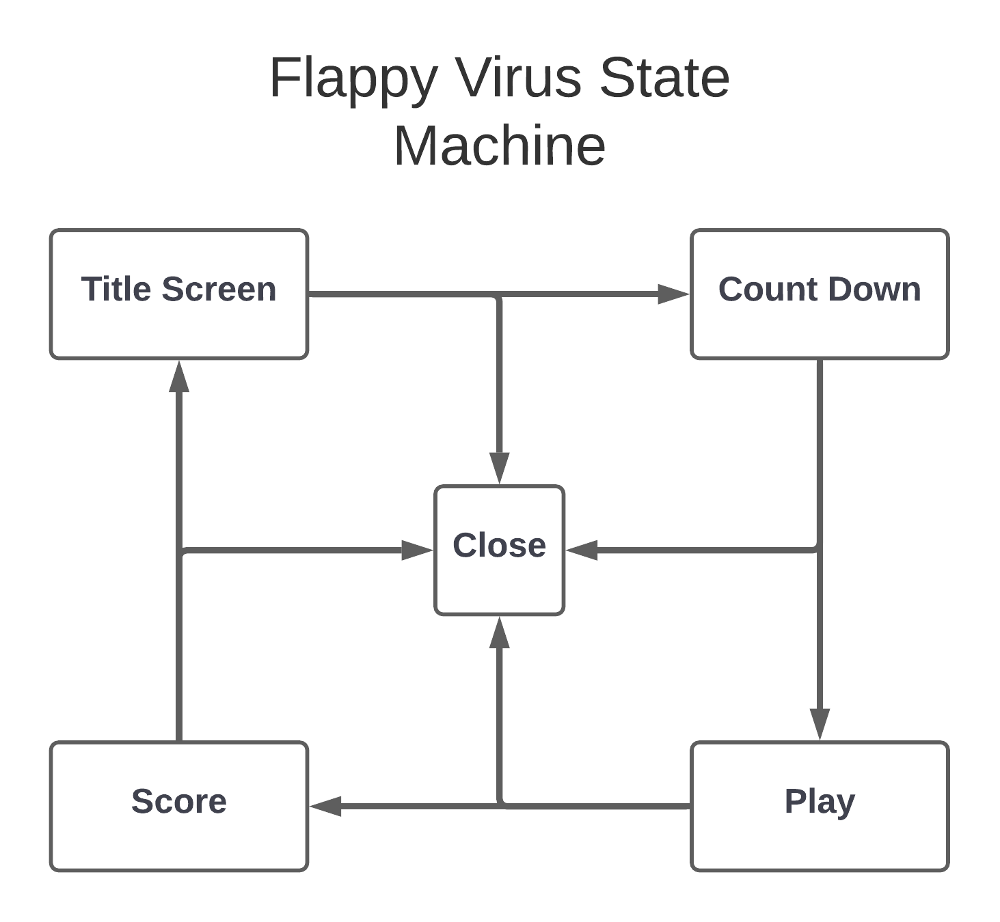

# Flappy Virus

Juego estilo Flappy Bird, con temática de COVID19

Por Carlos R. Acosta Herrera y Victor A. Canales Lima

Basado en:

Colton Ogden & David J. Malan. (2021). Games50/fifty-bird (Versión 12) [Lua; Multiplatform LÖVE2D]. CS50’s Introduction to Game Development. https://github.com/games50/fifty-bird 

(Original work published 2018)
freeCodeCamp.org. (2019). Flappy Bird (with Lua) (Vol. 2) [YouTube Video]. CS50. https://www.youtube.com/watch?v=rBHusPevM5k

## Folder Structure

### fonts
 Folder to store fonts used in the videogame (only one in this case)
### images
All images are stored ehre, even those included for the sprites
### sounds
All sound effects, included background music, are stored here
### objects
It is the folder that stores all lua files that describe and have all the information to generate the different states of the game
### lib
It contains class.lua, push.lua and StateMachine.lua, lua classes which usage is described next in project Structure.

## Program Structure

### main.lua
 It is the entry point of the game, it loads all the resources (images, sound effects and fonts) except by those from the sprites. State Machine is initialized and here is where the videogame is rendered.
 ### StateMachine.lua
 This lua code generates the desired state only when it is needed, saving memory, it is managed through a table and string ids linked to an initialization function (from the ./states/ lua files) which will  return a table with Render, Update, Enter and Exit methods.
### BaseState.lua
It is the superclass from which come all state classes in the state machine, this help us to not redefine methods for every state.
### CountdownState.lua
It is the state previous to the beginning of the game, when a count from 3 to 1 is made. It renders the numbers only.
### PlayState.lua
It is the state previous to the beginning of the game, when a count from 3 to 1 is made. Here is where an instance of the object Virus, as well as a table of objects PipePairs. Furthermore, here is where the pairs of pipes with random heights are created and included in the table.
### ScoreState.lua
This is the "game over" state, where the final Score is shown. Instructions to play again or finish are also shown.
### TitleScreen.lua
This is the initial state, where the title of the game and the instructions to start or finish are shown.
